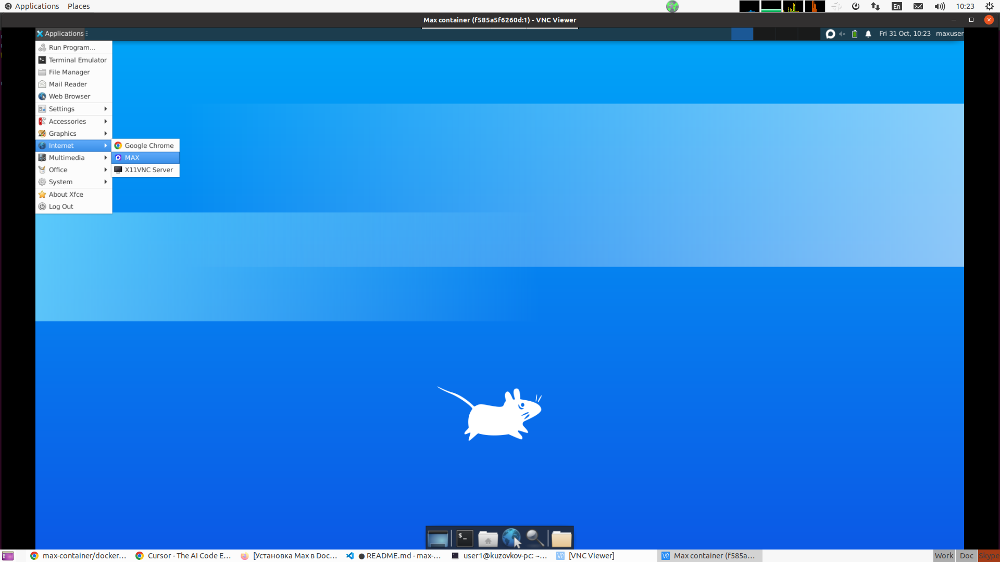

### Build

Download `MAX.deb` package and put it to root of project
Create folder `data` in root of project
```bash
docker compose build
```

### Usage
```bash
docker compose up -d
```

Connect use VNC Viewer to 127.0.0.1:5901

Screenshot with interface:



